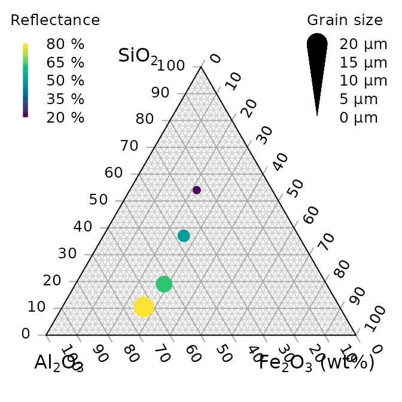
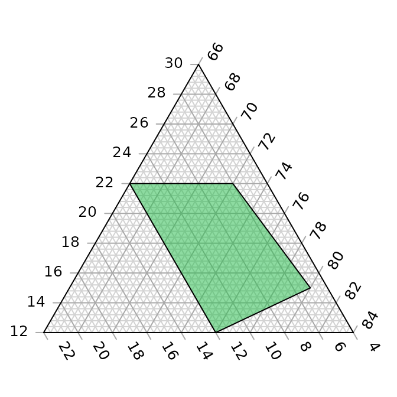

# Create Ternary Plots in R

“Ternary” is an R package to allow the creation of ternary plots in the
standard R graphics environment. I hope that it proves simple to use.

For simple use cases, generate Ternary plots using the point-and-click
Shiny app:

``` r
install.packages("Ternary")
Ternary::TernaryApp()
```

For greater control over your plots, use the full R implementation.

Install the package with:

``` r
install.packages("Ternary")
```

Or if you want the latest development version of the package:

``` r
if (!require("devtools")) install.packages("devtools")
install_github("ms609/Ternary", args = "--recursive")
```

Once the package is installed, load it into the current R session with

``` r
library("Ternary")
```

There are two stages to creating a ternary plot: first, rendering the
plot, styled as you like it and pointing in any of the four compass
directions; secondly, adding data.

## Create a blank plot

At its simplest, all you need to do is type

``` r
TernaryPlot()
```


The following charts show which corners are which, under different
orientations:

``` r
par(mfrow = c(2, 2), mar = rep(0.5, 4))
for (dir in c("up", "right", "down", "le")) {
  TernaryPlot(point = dir, atip = "A", btip = "B", ctip = "C",
              alab = "Aness", blab = "Bness", clab = "Cness")
  TernaryText(list(A = c(10, 1, 1), B = c(1, 10, 1), C = c(1, 1, 10)),
              labels = c("P1", "P2", "P3"),
              col = cbPalette8[4], font = 2)
}
```


## Plot two stylised plots side by side, and plot data

First we will define some data that we wish to plot:

``` r
# Define data points
data_points <- list(
  R = c(255, 0, 0), 
  O = c(240, 180, 52),
  Y = c(210, 222, 102),
  G = c(111, 222, 16),
  B = c(25, 160, 243),
  I = c(92, 12, 243),
  V = c(225, 24, 208)
)

# Compute RGB colours based on point values
PointColour <- function(x) {
  rgb(x[1], x[2], x[3], maxColorValue = 255, # Use point values for RGB
      alpha = 128 # Semitransparency
      )
}

# Precompute the colour for each point
data_col <- sapply(data_points, PointColour)
```

Now we set up our plotting area to display two plots side by side, and
produce the plots.

``` r
par(                          # Configure plotting area
  mfrow = c(1, 2),            # Plot one row of panels in two columns
  mar = c(0.3, 0.3, 1.3, 0.3) # Set margins for each plot
)

# Initial plot
TernaryPlot(alab = "Redder \u2192", blab = "\u2190 Greener", clab = "Bluer \u2192",
            lab.col = c("red", "darkgreen", "blue"),
            main = "Colours", # Title
            point = "right", lab.cex = 0.8, grid.minor.lines = 0,
            grid.lty = "solid", col = rgb(0.9, 0.9, 0.9), grid.col = "white", 
            axis.col = rgb(0.6, 0.6, 0.6), ticks.col = rgb(0.6, 0.6, 0.6),
            axis.rotate = FALSE,
            padding = 0.08)

# Colour the background:
cols <- TernaryPointValues(rgb)
ColourTernary(cols, spectrum = NULL)

# Add the data to the plot
AddToTernary(graphics::points, data_points, pch = 21, cex = 2.8, bg = data_col)
AddToTernary(text, data_points, names(data_points), cex = 0.8, font = 2)
legend("bottomright", 
       legend = c("Red", "Orange", "Yellow", "Green"),
       cex = 0.8, bty = "n", pch = 21, pt.cex = 1.8,
       pt.bg = c(rgb(255,   0,   0, 128, NULL, 255), 
                 rgb(240, 180,  52, 128, NULL, 255),
                 rgb(210, 222, 102, 128, NULL, 255),
                 rgb(111, 222,  16, 128, NULL, 255)),
       )


###
# Next plot:
###
TernaryPlot("Steam", "Ice", "Water", 
            grid.lines = 5, grid.lty = "dotted",
            grid.minor.lines = 1, grid.minor.lty = "dotted",
            point = "West")

# Another way to add a title
title("Water phases", cex.main = 0.8)

# Add horizontal grid lines
HorizontalGrid()

# Define a polygon
middle_triangle <- matrix(c(
  30, 40, 30,
  30, 30, 40,
  55, 20, 25
), ncol = 3, byrow = TRUE)

# Add polygon to plot
TernaryPolygon(middle_triangle, col = "#aaddfa", border = "grey")

# Connect corners of polygon to plot corners
TernaryLines(list(c(0, 100, 0), middle_triangle[1, ]), col = "grey")
TernaryLines(list(c(0, 0, 100), middle_triangle[2, ]), col = "grey")
TernaryLines(list(c(100, 0, 0), middle_triangle[3, ]), col = "grey")

# Add an arrow
TernaryArrows(c(20, 20, 60), c(30, 30, 40), length = 0.2, col = "darkblue")
```


### Styling points

More sophisticated plots can be created, for example styling each point
according to additional properties of the data, in a manner analogous to
the standard plotting functions:

``` r
# Configure plotting area
par(mar = rep(0.3, 4))

# Example data object
dat <- data.frame(sio2 = c(2, 4, 10, 20),
                  fe2o3 = c(5, 6, 7, 8),
                  al2o3 = c(12, 11, 10, 9),
                  grain_size = c(20, 16, 12, 8),
                  reflectance = c(80, 63, 51, 20))

# Define a colour spectrum
spectrumBins <- 255 # Number of bins to use
mySpectrum <- rowCol <- hcl.colors(spectrumBins, palette = "viridis")

# Cut our reflectance data into categories
binnedReflectance <- cut(dat$reflectance, spectrumBins)

# Assign each data point a colour from the spectrum
pointCol <- mySpectrum[binnedReflectance]


# Define a size range
maxSize <- 2.4 # Size of largest point, in plotting units
sizes <- dat$grain_size
pointSize <- sizes * maxSize / max(sizes)

# Initialize the plot
TernaryPlot(atip = expression(SiO[2]),
            btip = expression(paste(Fe[2], O[3], " (wt%)")),
            ctip = expression(paste(Al[2], O[3]))
)

# Plot the points
TernaryPoints(dat[, c("sio2", "fe2o3", "al2o3")],
              cex = pointSize, # Point size
              col = pointCol,  # Point colour
              pch = 16         # Plotting symbol (16 = filled circle)
              )

# Legend for colour scale
PlotTools::SpectrumLegend(
  "topleft",
  cex = 0.8, # Font size
  palette = mySpectrum,
  legend = paste(
    seq(from = max(dat$reflectance), to = min(dat$reflectance),
        length.out = 5),
    "%"
  ),
  bty = "n", # No framing box
  xpd = NA, # Don't clip at margins
  # title.font = 2, # Bold.  Argument only available in R>3.6
  title = "Reflectance"
)

# Legend for point size
PlotTools::SizeLegend(
  "topright",
  width = c(0, maxSize),
  lend = "round", # Round end of scale bar
  legend = paste(
    signif(seq(max(sizes), 0, length.out = 5), digits = 3),
    "\u03bcm" # µm
  ),
  title = "Grain size",
  # title.font = 2, # Bold. Argument only available in R>3.6
  bty = "n", # Do not frame with box
  cex = 0.8
)
```



See the “Points” tab of the shiny app for a point-and-click
implementation.

### Cartesian coordinates

It is also possible to use Cartesian coordinates to plot onto the graph.

By default, the plotting area is a 1×1 square.

``` r
par(mar = rep(0, 4)) # Reduce margins
TernaryPlot(point = "right", clockwise = FALSE)
cat("X range in this orientation:", TernaryXRange())
```

    ## X range in this orientation: -0.0669873 0.9330127

``` r
cat("Y range in this orientation:", TernaryYRange())
```

    ## Y range in this orientation: -0.5 0.5

``` r
arrows(x0 = 0.5, y0 = 0.4, x1 = sqrt(3) / 2, y1 = 0.4, length = 0.1,
       col = cbPalette8[2])
text(x = mean(c(0.5, sqrt(3) / 2)), y = 0.4, "Increasing X", pos = 3,
     col = cbPalette8[2])
text(x = 0.5, y = 0, "(0.5, 0)", col = cbPalette8[3])
text(x = 0.8, y = -0.5, "(0.8, -0.5)", col = cbPalette8[3])
```


Note the anticlockwise axis labelling on this plot, obtained using
`clockwise = FALSE`.

## Contours

A plot can be coloured and contoured according to the output of a
mathematical expression:

``` r
par(mar = rep(0.2, 4))
TernaryPlot(alab = "a", blab = "b", clab = "c")

FunctionToContour <- function(a, b, c) {
  a - c + (4 * a * b) + (27 * a * b * c)
}

# Add contour lines
values <- TernaryContour(FunctionToContour, resolution = 36L, filled = TRUE)
zRange <- range(values$z, na.rm = TRUE)

# Continuous legend for colour scale
PlotTools::SpectrumLegend(
  "topleft",
  legend = round(seq(zRange[1], zRange[2], length.out = 4), 3),
  palette = hcl.colors(265, palette = "viridis", alpha = 0.6),
  bty = "n",    # No framing box
  inset = 0.02,
  xpd = NA      # Do not clip at edge of figure
)
```


or according to the density of points across the plot:

``` r
par(mar = rep(0.2, 4))
TernaryPlot(axis.labels = seq(0, 10, by = 1))

nPoints <- 4000L
coordinates <- cbind(abs(rnorm(nPoints, 2, 3)),
                     abs(rnorm(nPoints, 1, 1.5)),
                     abs(rnorm(nPoints, 1, 0.5)))

# Colour plot background
ColourTernary(TernaryDensity(coordinates, resolution = 10L))

# Add points
TernaryPoints(coordinates, col = "red", pch = ".")

# Contour by point density
TernaryDensityContour(coordinates, resolution = 30L)
```


## Magnification

Perhaps the action on a plot is constrained to a small region of ternary
space. It’s possible to “zoom in” – i.e. magnify and crop the ternary
plot to the region of interest.

To do this you can specify the *x* and *y* limits of the region of
interest.

`TernaryCoords` might be useful in establishing the Cartesian
coordinates of a particular point in ternary space.  
Ensure that *dx* = *dy* if you want an isometric plot.

``` r
# Define points corresponding to corners of a region to plot
my_corners <- list(c(22, 66, 12), c(22, 72, 6), c(15, 80, 5), c(12, 76, 12))

# Print Cartesian coordinates of points
vapply(my_corners, TernaryCoords, direction = 1, FUN.VALUE = c(x = 0, y = 0))
```

    ##        [,1]      [,2]      [,3]     [,4]
    ## x 0.2700000 0.3300000 0.3750000 0.320000
    ## y 0.1905256 0.1905256 0.1299038 0.103923

The `padding` parameter is added as a margin to each side of the region
specified using `xlim` and `ylim`:

``` r
# Remove plot margins
par(mar = rep(0, 4))

# Create clipped plotting area
TernaryPlot(xlim = c(0.28, 0.38), ylim = c(0.1, 0.2), padding = 0.04)

# Annotate grid lines at user-specified points:
TernaryText(list(c(8, 72, 20), c(8, 82, 10)), c(20, 10), srt = -60, cex = 0.9,
            col = "darkgrey")
TernaryText(list(c(10, 69, 21), c(20, 64, 16)), c(10, 20), srt = 0, cex = 0.9,
            col = "darkgrey")

# Plot desired polygon
TernaryPolygon(my_corners, col = "#2cbe4e88")

# Show xlim, ylim and padding, using Cartesian coordinates
lines(c(0.28, 0.28, 0.38, 0.38, 0.28), c(0.1, 0.2, 0.2, 0.1, 0.1))
text(0.28, 0.15, "xlim[1]", pos = 2, srt = 90)
text(0.38, 0.15, "xlim[2]", pos = 4, srt = 90)
text(0.33, 0.1, "ylim[1]", pos = 1)
text(0.33, 0.2, "ylim[2]", pos = 3)
text(0.38, 0.1, "<padding>", pos = 4, cex = 0.75)
text(0.38, 0.1, "<padding> ", pos = 2, cex = 0.75, srt = 90)
```


An alternative approach is to plot a triangular sub-region of the larger
ternary space, allowing axis annotations to be read more easily.

``` r
par(mar = rep(0.2, 4))
TernaryPlot(region = my_corners) # Fit plotted region to data
TernaryPolygon(my_corners, col = "#2cbe4e88")
```



A region can be defined manually; the smallest triangle that covers the
region will be employed.

``` r
par(mar = rep(0.2, 4))
region <- list(
   c(amin = 10, bmin = 70, cmin = 0),
   c(amax = 30, bmax = 70, cmax = 10)
)
TernaryPlot(region = region)

# Data will be plotted even if it falls outside the plotted axes
TernaryPolygon(my_corners, col = "#2cbe4e88")
```


## Further tutorials

For further examples of usage, see the accompanying vignettes:

- [Introduction for new R
  users](https://ms609.github.io/Ternary/articles/new-users.md)

- [Interpolating and
  contouring](https://ms609.github.io/Ternary/articles/interpolation.md)

- [Annotation of
  points](https://ms609.github.io/Ternary/articles/annotation.md)

- [Plotting Holdridge climate
  zones](https://ms609.github.io/Ternary/articles/Holdridge.md)

## Bugs and feature requests

I hope the package proves useful. If there’s anything it can’t do that
you wish it could, please let me know by opening a [Github
issue](https://github.com/ms609/Ternary/issues/new?title=Suggestion:+).
