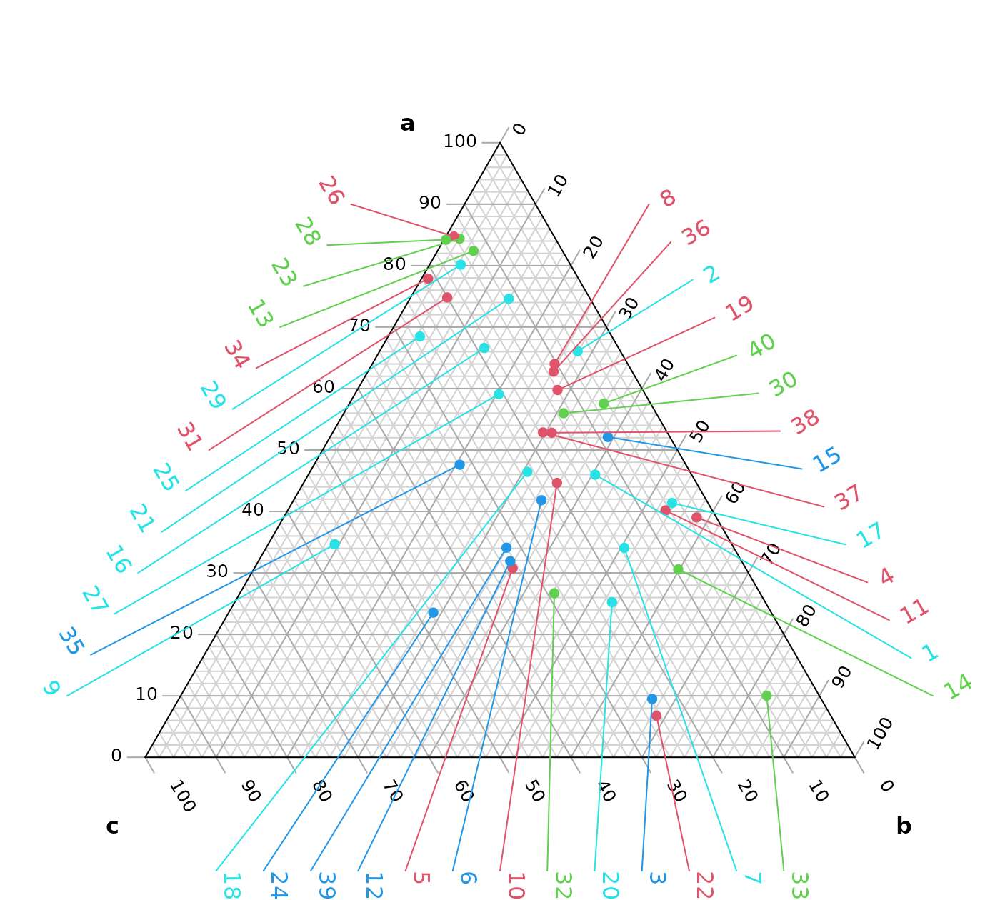

# Adding annotations

> Before you start, have you read the [introduction to the Ternary
> package](https://ms609.github.io/Ternary/articles/Ternary.md)?

This vignette explores how to annotate specific points within a ternary
plot. We’ll start by generating some example data:

``` r
set.seed(40) # For reproducibility

nPoints <- 40
points <- data.frame(
  a = abs(rnorm(nPoints, 2, 3)),
  b = abs(rnorm(nPoints, 1, 1.5)),
  c = abs(rnorm(nPoints, 1, 0.5)),
  col = sample(2:5, nPoints, replace = TRUE),
  label = paste("Point", seq_len(nPoints))
)
```

It’s simple to plot and annotate all points with automatically
positioned labels:

``` r
library("Ternary") # Load the Ternary package

# Create ternary plot
par(mar = rep(0.2, 4)) # Set figure margins
TernaryPlot("a", "b", "c")

# Add points
TernaryPoints(points[, 1:3], col = points[, "col"], pch = 16)

# Add annotations automatically
Annotate(points[, 1:3], col = points[, "col"])
```



If we want more control than the
[`Annotate()`](https://ms609.github.io/Ternary/reference/Annotate.md)
function permits, we can manually select which points to annotate and
where to place their labels.

``` r
# Create ternary plot
par(mar = rep(0.2, 4)) # Set figure margins
TernaryPlot("a", "b", "c")

# Add points
TernaryPoints(points[, 1:3], col = points[, "col"], pch = 16)

# Choose points to label
toLabel <- c(10, 20, 30, 40)

# Get Cartesian coordinates of points
# Note that we need to rotate the data.frame with `t()`
pointXY <- TernaryToXY(t(points[toLabel, c("a", "b", "c")]))

# We will manually specify where we want to position our labels.
# It can help to establish the coordinates of the figure region:
par("usr") # c(x1, x2, y1, y2)
```

    ## [1] -0.6264000  0.6264000 -0.1933873  1.0594127

``` r
# And the X and Y range of the ternary plot itself:
TernaryXRange()
```

    ## [1] -0.5  0.5

``` r
TernaryYRange()
```

    ## [1] -0.0669873  0.9330127

``` r
# Manually select locations for labels:
labelXY <- rbind(c(0.28, 0.7),
                 c(0.35, 0.6),
                 c(0.42, 0.5),
                 c(0.49, 0.4))[c(3, 4, 1, 2), ]

# Add labels to plot
text(labelXY,
     labels = points[toLabel, "label"],
     col = points[toLabel, "col"],
     pos = 4, # Place text to right of coordinate
     xpd = NA # Don't clip at figure limit
     )

# Connect labels to points
segments(
  pointXY["x", ], pointXY["y", ],
  labelXY[, 1], labelXY[, 2],
  lwd = 2, # Line width
  col = points[toLabel, "col"]
)
```


## Where next

For other examples of usage, see the accompanying vignettes:

- [Introduction for new R
  users](https://ms609.github.io/Ternary/articles/new-users.md)

- [Getting started
  guide](https://ms609.github.io/Ternary/articles/Ternary.md)

- [Interpolating and
  contouring](https://ms609.github.io/Ternary/articles/interpolation.md)

- [Plotting Holdridge climate
  zones](https://ms609.github.io/Ternary/articles/Holdridge.md)
