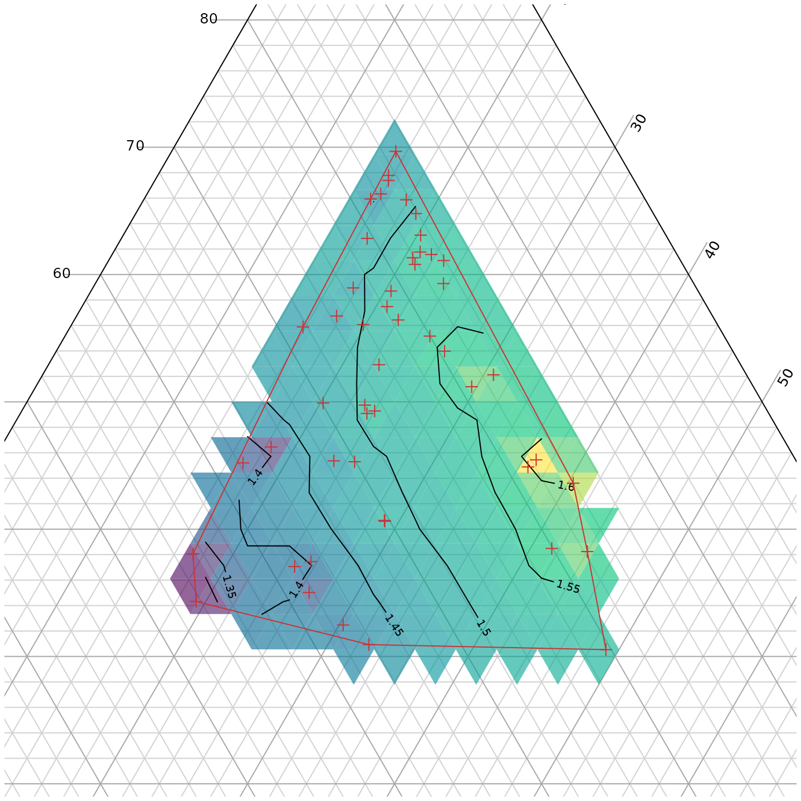

# Interpolating and contouring

> Before you start, have you read the [introduction to the Ternary
> package](https://ms609.github.io/Ternary/articles/Ternary.md)?

A ternary plot can be shaded and contoured according to a known
function:

``` r
library("Ternary")
par(mar = rep(0.2, 4))

FunctionToContour <- function(a, b, c) {
  a - c + (4 * a * b) + (27 * a * b * c)
}

values <- TernaryPointValues(FunctionToContour, resolution = 24L)
TernaryPlot(alab = "a", blab = "b", clab = "c",
            # Place an opaque fill behind grid lines:
            panel.first = ColourTernary(values, spectrum = hcl.colors(256)))
TernaryContour(FunctionToContour, resolution = 36L, legend = TRUE, 
               legend... = list(bty = "n"))
```


If it is not computationally feasible to execute a function at every
point, it is possible to interpolate between known values.

Inverse distance weighting is a simple approach:

``` r
# If using your own data, set
# abc <- [Three-column matrix containing a, b, c coordinates of points]
# response <- [Vector of values at the points specified in abc]

# We'll use random data for this example.

# First we'll generate some points at which to sample:
set.seed(0)
nPts <- 50
a <- runif(nPts)
b <- runif(nPts) * (1 - a)
c <- 1 - a - b
abc <- rbind(a, b, c)

# Then we'll measure the response variable at each of those points:
response <- FunctionToContour(a, b, c)


# Now we must start a plot, to define the coordinate system
par(mar = rep(0.2, 4))
TernaryPlot(alab = "a", blab = "b", clab = "c")

# Convert measured points to XY
xy <- TernaryToXY(abc)

# Use an inverse distance weighting to interpolate between measured points
Predict <- function(predXY) {
  Distance <- function(a, b) {
    apply(a, 2, function(pt) sqrt(colSums((pt - b) ^ 2)))
  }
  dists <- Distance(xy, predXY)
  id <- 1 / dists
  idw <- id / rowSums(id)

  # Return:
  colSums(response * t(idw))
}

# Predict at triangle centres
tri <- TriangleCentres(resolution = 12L)
# Adjust the resolution to suit your own dataset

# Now we interpolate between our known values to generate a colour for each
# of our tiles
predicted <- Predict(tri[1:2, ])
map <- rbind(x = tri["x", ], y = tri["y", ], z = predicted,
             down = tri["triDown", ])

# Place a semitransparent colour fill over grid lines:
ColourTernary(map)

# Calculate contours
PredictABC <- function(a, b, c) Predict(TernaryToXY(rbind(a, b, c)))
TernaryContour(PredictABC, resolution = 36L, legend = 6, 
               legend... = list(bty = "n"))

# Mark the points at which we took measurements
TernaryPoints(abc, pch = 3, col = "#cc3333")
```


More sophisticated interpolation approaches are possible, e.g. 
[kriging](https://desktop.arcgis.com/en/arcmap/10.3/tools/3d-analyst-toolbox/how-kriging-works.htm);
these may help to alleviate artefacts of sampling intensity as observed
towards the bottom of the example plot above.

## Interpolation within a sampled region

We might also encounter a situation where we have only sampled a small
region of ternary space and do not wish to extrapolate beyond this
region.

``` r
# Select some points at which to sample
set.seed(0)
nPts <- 50
a <- runif(nPts, 0.3, 0.7)
b <- 0.15 + runif(nPts, 0, 0.7 - a)
c <- 1 - a - b
abc <- rbind(a, b, c)

# Measure the response variable at each of those points:
response <- FunctionToContour(a, b, c)

# Convert measured points to XY
xy <- TernaryToXY(abc, direction = 1)

# Start a plot, to define the coordinate system
par(mar = rep(0.2, 4))
TernaryPlot(alab = "a", blab = "b", clab = "c",
            # Only plot the sampled region:
            xlim = range(xy["x", ]), ylim = range(xy["y", ])
)

# Get centres of tiles to plot
tri <- TriangleCentres(resolution = 36L)
# Adjust the resolution to suit your own dataset

# Calculate which triangular tiles are within the boundaries of our data
inHull <- TriangleInHull(tri, abc)

# Pre-generate an empty list of predictions
predicted <- rep(NA, ncol(tri))

# Now we interpolate between our known values to generate a colour for each
# of our tiles
predicted[inHull$inside] <- Predict(tri[1:2, inHull$inside])
map <- rbind(tri, z = predicted)

# Colour only those tiles where we have made a prediction
ColourTernary(map)

# Calculate contours
PredictABC <- function(a, b, c) Predict(TernaryToXY(rbind(a, b, c)))
TernaryContour(PredictABC, resolution = 36L,
               # `within` controls where contours are calculated
               within = inHull$hull)


# Mark the points at which we took measurements
TernaryPoints(abc, pch = 3, col = "#cc3333")

# Mark the region in which we sampled
polygon(t(xy)[chull(t(xy)), ], border = "#cc3333")
```



## Where next

For other examples of usage, see the accompanying vignettes:

- [Introduction for new R
  users](https://ms609.github.io/Ternary/articles/new-users.md)

- [Getting started
  guide](https://ms609.github.io/Ternary/articles/Ternary.md)

- [Annotation of
  points](https://ms609.github.io/Ternary/articles/annotation.md)

- [Plotting Holdridge climate
  zones](https://ms609.github.io/Ternary/articles/Holdridge.md)
